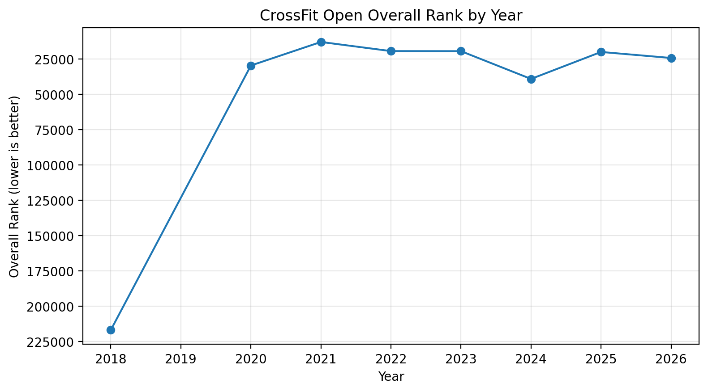
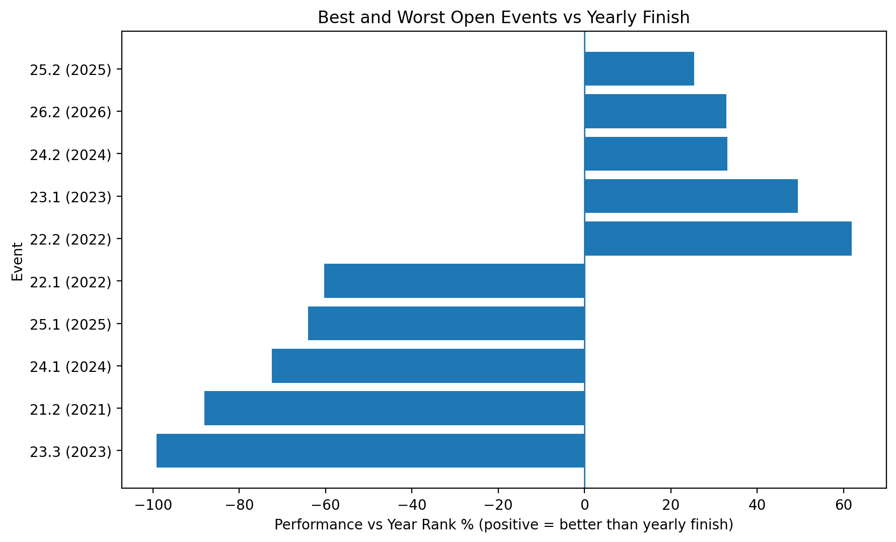
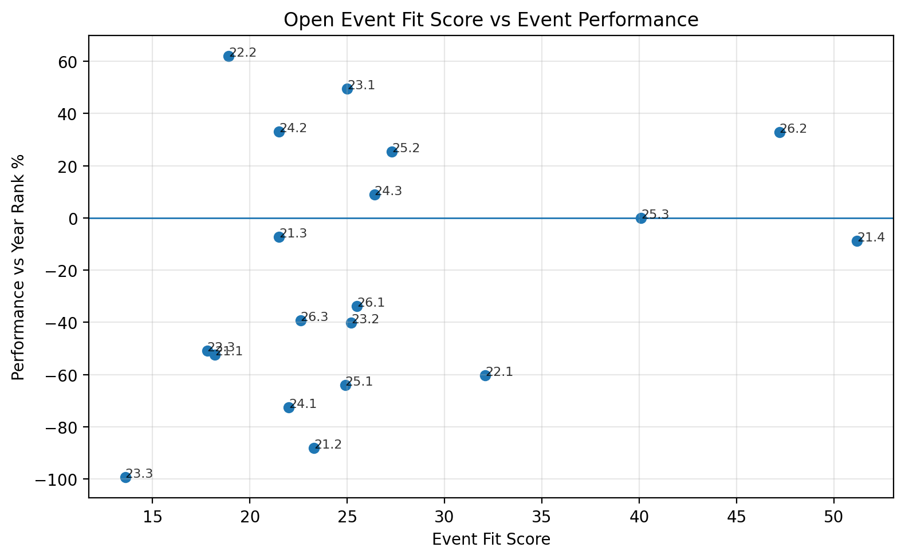
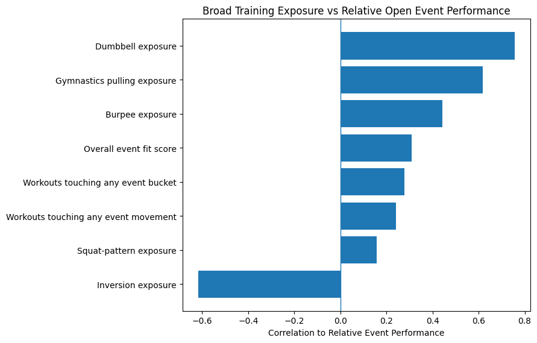

# CrossFit Open Performance Case Study

This project combines SugarWOD training history, CrossFit Open leaderboard results, and Open workout definitions to analyze which training patterns appear to support stronger Open performances and where targeted improvements are needed.

## Problem

I wanted to understand whether my training before each CrossFit Open aligned with the demands of the workouts I performed well or poorly in.

The goal was not just to review past results, but to turn the analysis into a practical training plan for the next Open season.

## Data Sources

### SugarWOD workout history
- Source: exported personal workout logs
- Use: measure training volume, movement exposure, and prep patterns

### CrossFit Open leaderboard results
- Source: collected leaderboard results by year and event
- Use: yearly and event-level performance outcomes

### CrossFit Open workout definitions
- Source: collected Open workout descriptions by year
- Use: identify movement demands and compare them to prior training exposure

## Approach

This project followed four main steps:

1. Pulled and cleaned SugarWOD training data
2. Pulled and structured CrossFit Open leaderboard and workout data
3. Engineered movement and event-fit features
4. Compared pre-Open training exposure to Open event outcomes

## Analytics Performed

The analysis focused on:
- year-over-year Open finish trends
- best and worst event finishes relative to yearly rank
- movement exposure in the pre-Open training window
- event-fit scoring based on how closely prior training matched Open workout demands
- movement and bucket-level relationship checks to identify patterns that transferred well and patterns that did not

## Key Findings

- Overall training volume alone did not explain Open performance well
- Better finishes tended to align with rowing, cyclical engine, hinge-dominant work, and gymnastics pulling
- Worse finishes tended to align with wall walks, inversion, snatch-heavy conditioning, and burpee-to-implement transitions
- The strongest signal was not raw movement exposure, but how transferable that exposure was to Open-style fatigue and combinations









## Training Recommendations

Based on the analysis, the highest-priority development areas are:
- wall walk and inversion work under fatigue
- snatch cycling in conditioning
- thruster and clean receiving under fatigue
- burpee-to-barbell and burpee-to-dumbbell transitions
- squat-based movement under breathing and shoulder disruption

Suggested annual structure:
- April to August: base-building
- September to November: weakness-biased development
- December to January: Open-specific conversion
- February to March: competition sharpening

## Repo Structure

```text
crossfit-open-performance-case-study/
├── ingestion/
├── data/
│   ├── raw/
│   └── derived/
├── images/
├── notebooks/
├── src/
├── sql/
├── README.md
└── CASE_STUDY.md